### DFS(深度优先)

是一种图的遍历算法。

深度优先搜索在搜索过程中访问某个顶点后，需要递归地访问此顶点的所有未访问过的相邻顶点。
初始条件下所有节点为白色，选择一个作为起始顶点，按照如下步骤遍历：

1. 选择起始顶点涂成灰色，表示还未访问
2. 从该顶点的邻接顶点中选择一个，继续这个过程（即再寻找邻接结点的邻接结点），一直深入下去，直到一个顶点没有邻接结点了，涂黑它，表示访问过了
3. 回溯到这个涂黑顶点的上一层顶点，再找这个上一层顶点的其余邻接结点，继续如上操作，如果所有邻接结点往下都访问过了，就把自己涂黑，再回溯到更上一层。
4. 上一层继续做如上操作，知道所有顶点都访问过。


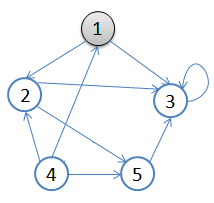

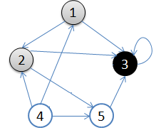

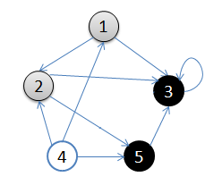

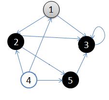

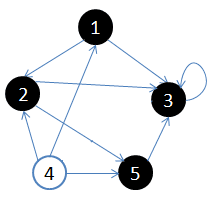

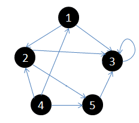

从顶点1开始做深度搜索：

1. 初始状态，从顶点1开始
2. 依次访问过顶点1,2,3后，终止于顶点3
3. 从顶点3回溯到顶点2，继续访问顶点5，并且终止于顶点5
4. 从顶点5回溯到顶点2，并且终止于顶点2
5. 从顶点2回溯到顶点1，并终止于顶点1
6. 从顶点4开始访问，并终止于顶点4

复杂度：$O(n+m)$

#### 模板

```cpp
void dfs(int u) {
  vis[u] = 1;
  for (int i = head[u]; i; i = e[i].x) {
    // 这里用到的是链式前向星来存图
    if (!vis[e[i].t]) {
      dfs(v);
    }
  }
}
```

有些情况不需要标记，请自行判断。

### BFS(广度优先)

广度优先搜索在进一步遍历图中顶点之前，先访问当前顶点的所有邻接结点。

1. 首先选择一个顶点作为起始结点，并将其染成灰色，其余结点为白色。
2. 将起始结点放入队列中。
3. 从队列首部选出一个顶点，并找出所有与之邻接的结点，将找到的邻接结点放入队列尾部，将已访问过结点涂成黑色，没访问过的结点是白色。如果顶点的颜色是灰色，表示已经发现并且放入了队列，如果顶点的颜色是白色，表示还没有发现
4. 按照同样的方法处理队列中的下一个结点。

基本就是出队的顶点变成黑色，在队列里的是灰色，还没入队的是白色。用一副图来表达这个流程如下：

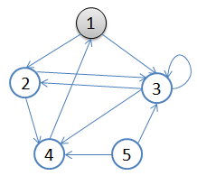

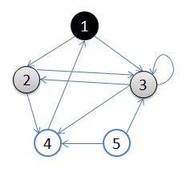

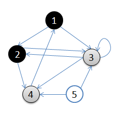

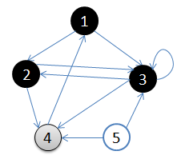

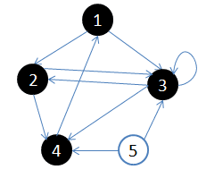


从顶点1开始进行广度优先搜索：

1. 初始状态，从顶点1开始，队列={1}
2. 访问1的邻接顶点，1出队变黑，2,3入队，队列={2,3,}
3. 访问2的邻接结点，2出队，4入队，队列={3,4}
4. 访问3的邻接结点，3出队，队列={4}
5. 访问4的邻接结点，4出队，队列={ 空} 结点5对于1来说不可达。

####  模板

```cpp
void bfs(int u) {
  while (!Q.empty()) Q.pop();
  Q.push(u);
  vis[u] = 1;
  d[u] = 0;
  p[u] = -1;
  while (!Q.empty()) {
    u = Q.pop() {
      for (int i = head[u]; i; i = e[i].x) {
        if (!vis[e[i].t]) {
          Q.push(e[i].t);
          vis[e[i].t] = 1;
          d[e[i].t] = d[u] + 1;
          p[e[i].t] = u;
        }
      }
    }
  }
}
void restore(int x) {
  vector<int> res;
  for (int v = x; v != -1; v = p[v]) {
    res.push_back(v);
  }
  std::reverse(res.begin(), res.end());
  for (int i = 0; i < res.size(); ++i) printf("%d", res[i]);
  puts("");
}
```

### 