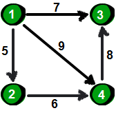
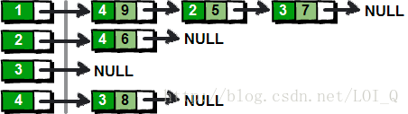
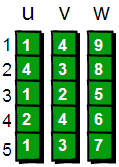

### 储存方式

#### 直接存

查询是否存在某条边：$O(1)$
遍历一个点的所有出边：$O(m)$
遍历整张图：$O(nm)$
空间复杂度：$O(nm)$


#### 邻接表

查询是否存在某条边：$O(log(d+(u)))$
遍历一个点的所有出边：$O(d+(u))$
遍历整张图：$O(n+m)$
空间复杂度：$O(m)$



第一行两个整数n m。n表示顶点个数（顶点编号为1~n），m表示边的条数。接下来m行表示，每行有3个数x y z，表示顶点x到顶点y的边的权值为z。下图就是一种使用链表来实现邻接表的方法。



上面这种实现方法为图中的每一个顶点（左边部分）都建立了一个单链表（右边部分）。这样我们就可以通过遍历每个顶点的链表，从而得到该顶点所有的边了。使用链表来实现邻接表对于痛恨指针的的朋友来说，这简直就是噩梦。这里我将为大家介绍另一种使用数组来实现的邻接表，这是一种在实际应用中非常容易实现的方法。这种方法为每个顶点i（i从1~n）也都保存了一个类似“链表”的东西，里面保存的是从顶点i出发的所有的边，具体如下。



创建邻接表:

```cpp
int n,m,i;
//u、v和w的数组大小要根据实际情况来设置，要比m的最大值要大1
int u[6],v[6],w[6];
//first和next的数组大小要根据实际情况来设置，要比n的最大值要大1
int first[5],next[5];
scanf("%d %d",&n,&m);
//初始化first数组下标1~n的值为-1，表示1~n顶点暂时都没有边
for(i=1;i<=n;i++)
    first[i]=-1;
for(i=1;i<=m;i++)
{
    scanf("%d %d %d",&u[i],&v[i],&w[i]);//读入每一条边
    //下面两句是关键啦
    next[i]=first[u[i]];
    first[u[i]]=i;
}
```

遍历1号顶点所有边:

```cpp
k=first[1];// 1号顶点其中的一条边的编号（其实也是最后读入的边）
while(k!=-1) //其余的边都可以在next数组中依次找到
{
    printf("%d %d %d\n",u[k],v[k],w[k]);
    k=next[k];
}
```

遍历每个顶点的所有边:

```cpp
for(i=1;i<=n;i++)
{
    k=first[i];
    while(k!=-1)
    {
        printf("%d %d %d\n",u[k],v[k],w[k]);
        k=next[k];
    }
}
```

#### 链式前向星

查询是否存在某条边：$O(d+(u))$
遍历一个点的所有出边：$O(d+(u))$
遍历整张图：$O(n+m)$
空间复杂度：$O(m)$

**链式前向星其实就是静态建立的邻接表**

我们先对上面的7条边进行编号第一条边是0以此类推编号【0~6】，然后我们要知道两个变量的含义：

Next，表示与这个边起点相同的上一条边的编号。
head[ i ]数组，表示以 i 为起点的最后一条边的编号。
 head数组一般初始化为-1，为什么是 -1后面会讲到。

初始化:

```cpp
struct Edge
{
    int to, w, next;//终点，边权，同起点的上一条边的编号
}edge[maxn];//边集
int head[maxn];//head[i],表示以i为起点的第一条边在边集数组的位置（编号）
void init()//初始化
{
    for (int i = 0; i <= n; i++) head[i] = -1;
    cnt = 0;
}
```

加边函数是这样的：

```cpp
void add_edge(int u, int v, int w)//加边，u起点，v终点，w边权
{
    edge[cnt].to = v; //终点
    edge[cnt].w = w; //权值
    edge[cnt].next = head[u];//以u为起点上一条边的编号，也就是与这个边起点相同的上一条边的编号
    head[u] = cnt++;//更新以u为起点上一条边的编号
}
```

遍历函数是这样的：

```cpp
for(int i = 1; i <= n; i++)//n个起点
    {
        cout << i << endl;
        for(int j = head[i]; j != -1; j = edge[j].next)//遍历以i为起点的边
        {
            cout << i << " " << edge[j].to << " " << edge[j].w << endl;
        }
        cout << endl;
    }
```

第一层for循环是找每一个点，依次遍历以【1，n】为起点的边的集合。第二层for循环是遍历以 i 为起点的所有边，k首先等于head[ i ]，注意head[ i ]中存的是以 i 为起点的最后一条边的编号。然后通过edge[ j ].next来找下一条边的编号。我们初始化head为-1，所以找到你最后一个边（也就是以 i 为起点的第一条边）时，你的edge[ j ].next为 -1做为终止条件。