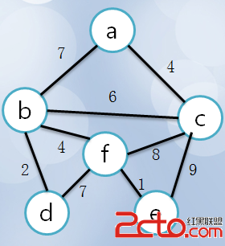
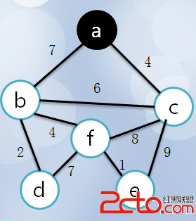
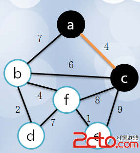
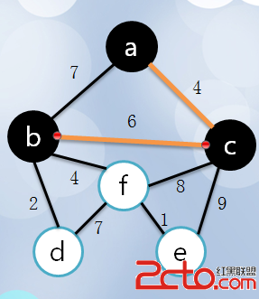
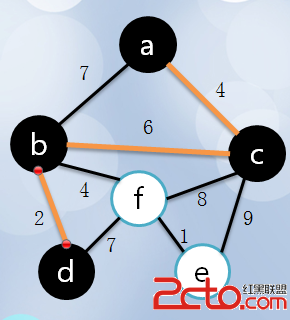
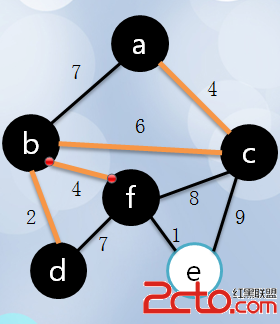
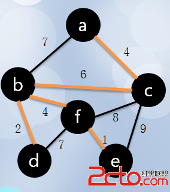
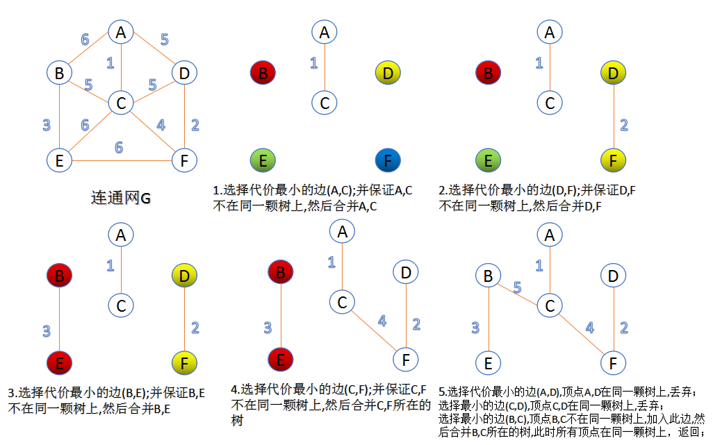

### 最小生成树（Prim）

#### 概念

**普里姆算法**（*Prim*算法），图论中的一种算法，可在加权连通图里搜索最小生成树。意即由此算法搜索到的边子集所构成的树中，不但包括了连通图里的所有顶点（英语：Vertex (graph theory)），且其所有边的权值之和亦为最小。该算法于1930年由捷克数学家沃伊捷赫·亚尔尼克（英语：Vojtěch Jarník）发现；并在1957年由美国计算机科学家罗伯特·普里姆（英语：Robert C. Prim）独立发现；1959年，艾兹格·迪科斯彻再次发现了该算法。因此，在某些场合，普里姆算法又被称为DJP算法、亚尔尼克算法或普里姆－亚尔尼克算法。

1. 在一个加权连通图中，顶点集合V，边集合为E
2. 任意选出一个点作为初始顶点,标记为`visit`,计算所有与之相连接的点的距离，选择距离最短的，标记`visit`.
3. 重复以下操作，直到所有点都被标记为`visit`：

在剩下的点中，计算与已标记`visit`点距离最小的点，标记`visit`,证明加入了最小生成树。















#### 代码实现

```cpp
H = new heap();
for (i = 1; i <= n; i++) H.insert(i, inf);
H.decrease_key(1, 0);
for (i = 1; i <= n; i++) {
    u = H.delete_min();
    for each edge(u, v, len) {
        H.decrease_key(v, len);
    }
}
```

### 最小生成树(Kruskal算法)

#### 概念

此算法可以称为“加边法”，初始最小生成树边数为0，每迭代一次就选择一条满足条件的最小代价边，加入到最小生成树的边集合里。 

1. 把图中的所有边按代价从小到大排序； 
2. 把图中的n个顶点看成独立的n棵树组成的森林； 
3. 按权值从小到大选择边，所选的边连接的两个顶点ui,viui,vi,应属于两颗不同的树，则成为最小生成树的一条边，并将这两颗树合并作为一颗树。 
4. 重复(3),直到所有顶点都在一颗树内或者有n-1条边为止。



#### 代码实现

```cpp
#include<iostream>
#include<cstdio>
#include<algorithm>
using namespace std;
int n,m,tot=0,k=0;//n端点总数，m边数，tot记录最终答案，k已经连接了多少边 
int fat[200010];//记录集体老大 
struct node
{
	int from,to,dis;//结构体储存边 
}edge[200010];
bool cmp(const node &a,const node &b)//sort排序（当然你也可以快排） 
{
	return a.dis<b.dis;
}
int father(int x)//找集体老大，并查集的一部分 
{
	if(fat[x]!=x)
	return father(fat[x]);
	else return x;
}
void unionn(int x,int y)//加入团体，并查集的一部分 
{
	fat[father(y)]=father(x);
}
int main()
{
	scanf("%d%d",&n,&m);//输入点数，边数 
	for(int i=1;i<=m;i++)
	{
		scanf("%d%d%d",&edge[i].from,&edge[i].to,&edge[i].dis);//输入边的信息 
	}
	for(int i=1;i<=n;i++) fat[i]=i;//自己最开始就是自己的老大 （初始化） 
	sort(edge+1,edge+1+m,cmp);//按权值排序（kruskal的体现） 
	for(int i=1;i<=m;i++)//从小到大遍历 
	{
		if(k==n-1) break;//n个点需要n-1条边连接 
		if(father(edge[i].from)!=father(edge[i].to))//假如不在一个团体 
		{
			unionn(edge[i].from,edge[i].to);//加入 
			tot+=edge[i].dis;//记录边权 
			k++;//已连接边数+1 
		}
	}
	printf("%d",tot);
	return 0;
}
```

